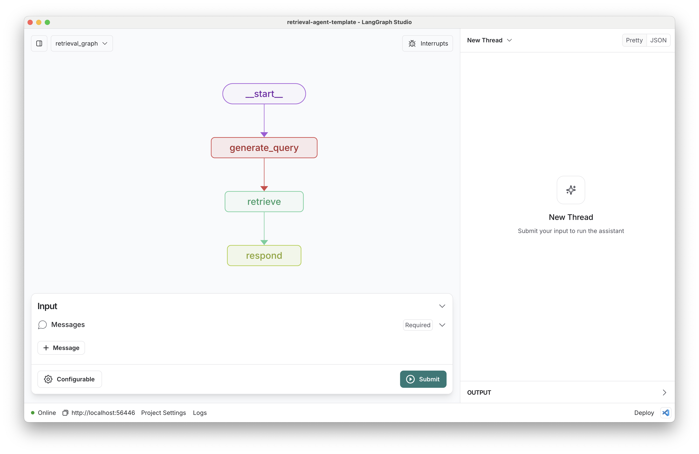

# Knowledge Retrieval and Reasoning System (KRRS)

An intelligent Multi-Agent System for Knowledge Retrieval and Reasoning in Education, built with [LangGraph](https://github.com/langchain-ai/langgraph) and designed for [LangGraph Studio](https://github.com/langchain-ai/langgraph-studio).



KRRS implements a sophisticated multi-agent architecture with specialized agents for different academic domains, featuring intelligent query routing, comprehensive retrieval capabilities, and built-in quality assurance through a critique system.

## What it does

KRRS is an advanced multi-agent educational system that implements a sophisticated architecture for knowledge retrieval and reasoning. The system consists of:

### Core Architecture

**Two Main Graphs:**
1. **Index Graph**: Processes and indexes educational documents for efficient retrieval
2. **Retrieval Graph**: Multi-agent system that provides intelligent responses to educational queries

### Multi-Agent Retrieval System

The retrieval graph implements a specialized multi-agent architecture:

```
User Query → Query Classification → Specialist Agent → Tools → Critique Agent → Response
```

**Specialist Agents:**
- **Science Agent**: Expert in natural sciences, mathematics, engineering, and technology
- **History Agent**: Specialist in historical events, figures, and analysis
- **Literature Agent**: Expert in literary works, criticism, and analysis  
- **General Agent**: Handles interdisciplinary and general knowledge topics

**Intelligent Features:**
- **Query Classification**: Automatically routes queries to the most appropriate specialist agent
- **Hybrid Retrieval**: Combines local knowledge base search with web search capabilities
- **Quality Assurance**: Built-in critique agent that evaluates responses and triggers improvements
- **Tool Integration**: Each agent can use retrieval and web search tools as needed

### How It Works

1. **Query Processing**: User input is classified into subject domains (science, history, literature, or general)
2. **Specialist Routing**: Query is routed to the appropriate specialist agent
3. **Knowledge Retrieval**: Agent searches local knowledge base and/or web for relevant information
4. **Response Generation**: Agent synthesizes information into comprehensive, educational responses
5. **Quality Control**: Critique agent evaluates response quality and may trigger retry if needed
6. **Final Response**: High-quality, subject-specific answer delivered to user

The system is designed for educational contexts, providing personalized, accurate, and pedagogically sound responses while maintaining conversation history and context awareness.

## Getting Started

Assuming you have already [installed LangGraph Studio](https://github.com/langchain-ai/langgraph-studio?tab=readme-ov-file#download), follow these steps to set up KRRS:

1. **Create Environment File**

```bash
cp .env.example .env
```

2. **Configure Your Setup**: Select your preferred retriever, models, and API keys. Add them to your `.env` file following the instructions below.

### Required Configuration

KRRS requires configuration for:
- **Retriever Provider**: For document indexing and retrieval (Elasticsearch recommended)
- **Language Models**: For specialist agents and query processing
- **Embedding Model**: For document vectorization
- **Optional**: Web search capabilities for enhanced retrieval

### Setup Retriever

KRRS currently supports Elasticsearch as the primary retriever provider, with a focus on local deployment for educational institutions.

**Default Configuration:**
```yaml
retriever_provider: elastic-local
```

#### Elasticsearch (Local Setup)

For educational environments, we recommend a local Elasticsearch setup that's optimized for development and classroom use.

##### Quick Setup with Docker

**Standard Local Setup:**
```bash
docker run -p 9200:9200 -d --name elasticsearch \
  -e ELASTIC_PASSWORD="your_secure_password" \
  -e "discovery.type=single-node" \
  -e "xpack.security.http.ssl.enabled=false" \
  -e "xpack.license.self_generated.type=trial" \
  docker.elastic.co/elasticsearch/elasticsearch:8.15.1
```

**Environment Configuration:**
```bash
# Local Elasticsearch Configuration
ELASTICSEARCH_URL=http://localhost:9200  # For direct access
# OR for Docker networking with LangGraph Studio:
# ELASTICSEARCH_URL=http://172.17.0.1:9200  # Use your Docker gateway IP
ELASTICSEARCH_HOST=localhost
ELASTICSEARCH_PORT=9200
ELASTICSEARCH_USER=elastic
ELASTICSEARCH_PASSWORD=your_secure_password
```

> **Note**: If LangGraph Studio runs in Docker and can't connect to `localhost:9200`, use the Docker gateway IP (typically `172.17.0.1`) or set up a custom Docker network as described below.

##### Docker Network Configuration for LangGraph Studio

**Important**: When using LangGraph Studio with Docker, Elasticsearch and LangGraph Studio containers must be on the same Docker network to communicate properly.

**Option 1: Use Default Bridge Network (Recommended)**
```bash
# Start Elasticsearch on default bridge network
docker run -p 9200:9200 -d --name elasticsearch \
  -e ELASTIC_PASSWORD="your_secure_password" \
  -e "discovery.type=single-node" \
  -e "xpack.security.http.ssl.enabled=false" \
  -e "xpack.license.self_generated.type=trial" \
  docker.elastic.co/elasticsearch/elasticsearch:8.15.1

# Use gateway IP in your .env file
ELASTICSEARCH_URL=http://172.17.0.1:9200  # or your Docker gateway IP
```

**Option 2: Create Custom Network**
```bash
# Create a custom network
docker network create krrs-network

# Start Elasticsearch on the custom network
docker run -p 9200:9200 -d --name elasticsearch --network krrs-network \
  -e ELASTIC_PASSWORD="your_secure_password" \
  -e "discovery.type=single-node" \
  -e "xpack.security.http.ssl.enabled=false" \
  -e "xpack.license.self_generated.type=trial" \
  docker.elastic.co/elasticsearch/elasticsearch:8.15.1

# Connect LangGraph Studio to the same network
# (This is typically done automatically by LangGraph Studio)

# Use container name in .env file
ELASTICSEARCH_URL=http://elasticsearch:9200
```

**Option 3: Find Your Docker Gateway IP**
```bash
# Find your Docker gateway IP
docker network inspect bridge | grep Gateway

# Use the gateway IP in your .env file
ELASTICSEARCH_URL=http://YOUR_GATEWAY_IP:9200
```

For detailed troubleshooting and network configuration, see [ELASTICSEARCH_SETUP.md](./ELASTICSEARCH_SETUP.md).

##### Alternative: Cloud Elasticsearch

**Elasticsearch Serverless (14-day trial):**
1. Sign up at [Elasticsearch Serverless](https://cloud.elastic.co/registration?onboarding_token=search&cta=cloud-registration&tech=trial&plcmt=article%20content&pg=langchain)
2. Get your Elasticsearch URL and create an API key
3. Configure your `.env`:

```bash
ELASTICSEARCH_URL=<ES_URL>
ELASTICSEARCH_API_KEY=<API_KEY>
```

**Elastic Cloud:**
1. Sign up at [Elastic Cloud](https://cloud.elastic.co/registration?onboarding_token=search&cta=cloud-registration&tech=trial&plcmt=article%20content&pg=langchain)
2. Create deployment and API key
3. Configure your `.env` as above


### Setup Language Models

KRRS uses multiple language models for different purposes:

**Default Configuration:**
```yaml
response_model: anthropic/claude-3-5-sonnet-20240620  # For specialist agents
query_model: anthropic/claude-3-haiku-20240307        # For query processing
```

#### Anthropic Claude (Recommended)

Anthropic's Claude models provide excellent performance for educational content:

1. Sign up for an [Anthropic API key](https://console.anthropic.com/)
2. Add to your `.env` file:

```bash
ANTHROPIC_API_KEY=your-api-key
```

**Model Options:**
- `claude-3-5-sonnet-20240620`: Best for complex reasoning and detailed explanations
- `claude-3-haiku-20240307`: Fast and efficient for query processing
- `claude-3-opus-20240229`: Most capable but slower

#### OpenAI Models

Alternative to Anthropic with strong educational performance:

1. Sign up for an [OpenAI API key](https://platform.openai.com/signup)
2. Add to your `.env` file:

```bash
OPENAI_API_KEY=your-api-key
```

**Model Options:**
- `gpt-4o`: Latest and most capable
- `gpt-4-turbo`: Good balance of performance and speed
- `gpt-3.5-turbo`: Cost-effective option


### Setup Embedding Model

KRRS uses embeddings to convert documents and queries into vector representations for semantic search.

**Default Configuration:**
```yaml
embedding_model: google/text-embedding-004
```

#### Google Embeddings (Default)

Google's text-embedding-004 provides excellent performance for educational content:

1. Get a [Google AI API key](https://aistudio.google.com/app/apikey)
2. Add to your `.env` file:

```bash
GOOGLE_API_KEY=your-api-key
```

#### OpenAI Embeddings

Alternative high-quality embedding option:

1. Use your existing OpenAI API key or get one at [OpenAI](https://platform.openai.com/signup)
2. Update configuration to use: `openai/text-embedding-3-small` or `openai/text-embedding-3-large`

```bash
OPENAI_API_KEY=your-api-key
```

#### Cohere Embeddings

Multilingual embedding support:

1. Sign up for a [Cohere API key](https://dashboard.cohere.com/welcome/register)
2. Add to your `.env` file:

```bash
COHERE_API_KEY=your-api-key
```

### Optional: Web Search Enhancement

Enable web search for enhanced information retrieval when local knowledge is insufficient:

```bash
# Optional: Enable web search with Tavily
TAVILY_API_KEY=your-tavily-api-key
```

Get a free API key at [Tavily](https://tavily.com/).

## Using KRRS

### 1. Index Educational Content

First, add educational content to your knowledge base using the **indexer** graph:

1. Open LangGraph Studio and select the **"indexer"** graph from the dropdown
2. Configure a `user_id` in the configuration panel
3. Add educational content in JSON format:

```json
[
  { "page_content": "Photosynthesis is the process by which plants convert light energy into chemical energy..." },
  { "page_content": "The American Civil War lasted from 1861 to 1865..." },
  { "page_content": "Shakespeare's Hamlet explores themes of revenge, mortality, and madness..." }
]
```

4. The system will process and index your documents for retrieval
5. Content is successfully indexed when the graph shows "delete" in memory

### 2. Query the Multi-Agent System

Switch to the **"retrieval_graph"** and interact with the intelligent multi-agent system:

1. Select **"retrieval_graph"** from the dropdown
2. Ensure the `user_id` matches your indexing configuration
3. Ask questions across different domains:

**Science Query:**
```
"Explain the process of photosynthesis and its importance in ecosystems"
```

**History Query:**
```
"What were the main causes and consequences of the American Civil War?"
```

**Literature Query:**
```
"Analyze the theme of revenge in Shakespeare's Hamlet"
```

**General Query:**
```
"How can I improve my study habits for better academic performance?"
```

### 3. Observe Multi-Agent Behavior

Watch how the system:
- **Classifies** your query into the appropriate domain
- **Routes** to the specialist agent (Science, History, Literature, or General)
- **Retrieves** relevant information from your knowledge base
- **Enhances** with web search if needed
- **Evaluates** response quality through the critique agent
- **Delivers** comprehensive, educational responses

### 4. User Context and Personalization

- Each `user_id` has isolated document access
- Change the `user_id` to see how responses change based on available knowledge
- The system maintains conversation context within each session

## Customization and Extension

KRRS provides multiple customization points for educational institutions and developers:

### 1. Agent Specialization

**Modify Specialist Agents** (`src/retrieval_graph/prompts.py`):
- Customize subject-specific prompts for different educational levels
- Add domain-specific reasoning frameworks
- Adjust response structures for your curriculum

**Add New Specialist Agents**:
- Create new agents for specific subjects (e.g., Mathematics, Physics, Computer Science)
- Implement in `src/retrieval_graph/graph.py`
- Update query classification system

### 2. Retrieval Enhancement

**Configure Search Parameters** (`src/retrieval_graph/configuration.py`):
- Adjust `search_kwargs` for retrieval fine-tuning
- Modify similarity thresholds
- Configure result limits

**Multi-Modal Retrieval**:
- Extend document processing for PDFs, images, audio
- Implement in `src/retrieval_graph/utils.py`

### 3. Model Configuration

**Language Models**:
- Switch between providers (Anthropic, OpenAI, etc.)
- Configure different models for different agents
- Adjust temperature and generation parameters

**Embedding Models**:
- Choose embeddings optimized for your content domain
- Configure multilingual embeddings for international education

### 4. Quality Assurance

**Critique System** (`src/retrieval_graph/prompts.py`):
- Customize evaluation criteria for educational standards
- Add domain-specific quality checks
- Implement fact-verification workflows

### 5. Integration and Deployment

**API Integration**:
- Connect to Learning Management Systems (LMS)
- Integrate with educational databases
- Add authentication and user management

**Performance Optimization**:
- Cache frequently accessed content
- Implement response time monitoring
- Scale agent deployment

### 6. Educational Features

**Assessment Integration**:
- Generate quiz questions from content
- Provide learning path recommendations
- Track student interaction patterns

**Curriculum Alignment**:
- Map content to educational standards
- Implement grade-level appropriate responses
- Add learning objective tracking

## Development

### Development Workflow

KRRS supports iterative development with hot reload capabilities:

1. **Real-time Testing**: Edit graph nodes and see changes immediately
2. **State Debugging**: Edit past states and rerun from specific points
3. **Node Isolation**: Test individual specialist agents independently
4. **Conversation Threading**: Use the `+` button to start fresh conversations

### Testing and Quality Assurance

**Run Tests:**
```bash
# Unit tests
make test

# Watch mode for continuous testing
make test_watch

# Extended tests including integration
make extended_tests
```

**Code Quality:**
```bash
# Linting and formatting
make lint
make format

# Type checking
make lint  # includes mypy
```

### Architecture Overview

**Core Components:**
- `src/retrieval_graph/graph.py`: Multi-agent workflow definition
- `src/retrieval_graph/prompts.py`: Specialist agent prompts and instructions
- `src/retrieval_graph/configuration.py`: System configuration and validation
- `src/retrieval_graph/state.py`: State management and data structures
- `src/retrieval_graph/retrieval.py`: Document retrieval and search logic
- `src/retrieval_graph/utils.py`: Utility functions and helpers

**Key Design Patterns:**
- **Agent Specialization**: Domain-specific agents with tailored prompts
- **Tool Integration**: Seamless tool calling for retrieval and web search
- **Quality Feedback Loop**: Critique-driven response improvement
- **Hierarchical Knowledge**: Local knowledge base + web search fallback

### Contributing

When contributing to KRRS:

1. **Follow Code Standards**: Use the provided linting and formatting tools
2. **Test Thoroughly**: Ensure changes work across different educational domains
3. **Document Changes**: Update prompts and configuration documentation
4. **Educational Focus**: Keep educational effectiveness as the primary goal

### Integration with Educational Tools

**LangSmith Integration**: Built-in tracing and collaboration features for educational teams.

**Monitoring**: Track agent performance, response quality, and student interaction patterns.

**Curriculum Mapping**: Extend the system to align with specific educational standards and learning objectives.
## Project Information

**Version**: 0.0.1  
**Author**: Sabin Pokharel (savinpokharel@gmail.com)  
**License**: MIT  

**Key Dependencies:**
- LangGraph: Multi-agent workflow orchestration
- LangChain: LLM and embedding integrations
- Elasticsearch: Vector storage and retrieval
- Anthropic/OpenAI: Language model providers
- Tavily: Web search capabilities

**Resources:**
- [LangGraph Documentation](https://github.com/langchain-ai/langgraph)
- [LangGraph Studio](https://github.com/langchain-ai/langgraph-studio)
- [LangSmith Tracing](https://smith.langchain.com/)
- [Elasticsearch Setup Guide](./ELASTICSEARCH_SETUP.md)